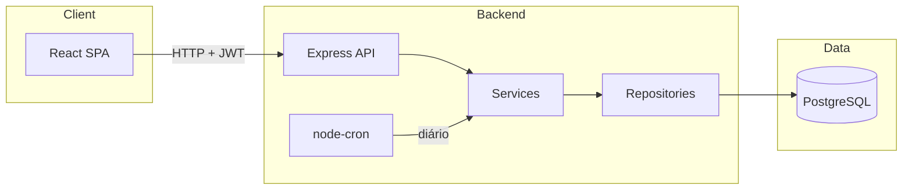
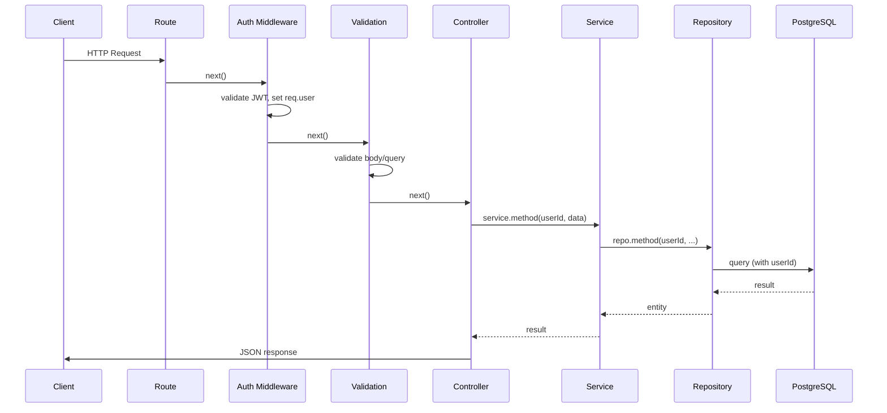

# Arquitetura (MVP)

## Visão geral

Arquitetura monolítica: um backend Node.js e um frontend React. Banco PostgreSQL. Sem microserviços, sem message brokers. Scheduler no mesmo processo do backend para recorrências.

## Separação de responsabilidades

- **Routes**: definem endpoints e aplicam middlewares (auth, validação).
- **Controllers**: extraem dados da requisição, chamam services, montam resposta.
- **Services**: regras de negócio, validações de domínio, chamadas a repositories.
- **Repositories**: operações de banco via ORM; sempre filtradas por `userId` quando for dado do usuário.
- **Middlewares**: auth (JWT), erro global, validação de payload.

## Fluxo de requisição HTTP

1. Request chega na rota.
2. Middleware de auth valida JWT e preenche `req.user`.
3. Middleware de validação (se houver) valida body/query.
4. Controller chama o service passando `req.user.id` e dados validados.
5. Service aplica regras, chama repository(ies).
6. Repository acessa banco sempre com `userId`.
7. Resposta sobe: Repository → Service → Controller → JSON + status.

## Scheduler de recorrência

- Uso de **node-cron** (ou equivalente) no mesmo processo do backend.
- Job configurado para rodar uma vez por dia (ex.: 00:05).
- Lógica: buscar recorrências mensais ativas cujo “próximo disparo” seja hoje (ou anterior); para cada uma, criar a transação correspondente e atualizar a data do próximo disparo (ex.: próximo mês).
- Garantir idempotência: não criar transação duplicada para o mesmo período (ex.: chave ou checagem por recorrência + mês/ano).
- Job deve ser enxuto: apenas “criar transações” e “atualizar próximo disparo”; sem filas ou workers externos.

## Validação de orçamento

- No service de transação (criação/atualização de despesa): após persistir, opcionalmente verificar se a soma das despesas da categoria no mês ultrapassou o orçamento do mês.
- Orçamento: um registro por (userId, categoryId, mês/ano). Consulta por categoria e mês.
- “Alerta” no MVP: pode ser um campo calculado na API (ex.: no GET de orçamento ou no relatório) indicando se está acima do limite, sem notificações push.

## Autenticação

- Login: POST com email/senha; backend valida e retorna JWT (access token).
- Registro: POST cadastra usuário (email, senha hash); pode retornar token ou exigir login em seguida.
- Rotas protegidas: middleware lê `Authorization: Bearer <token>`, valida JWT, anexa `req.user = { id, email }`.
- Senha: hash com bcrypt antes de persistir; nunca retornar senha nas respostas.

## Diagramas

### Arquitetura simplificada

### Fluxo de request

