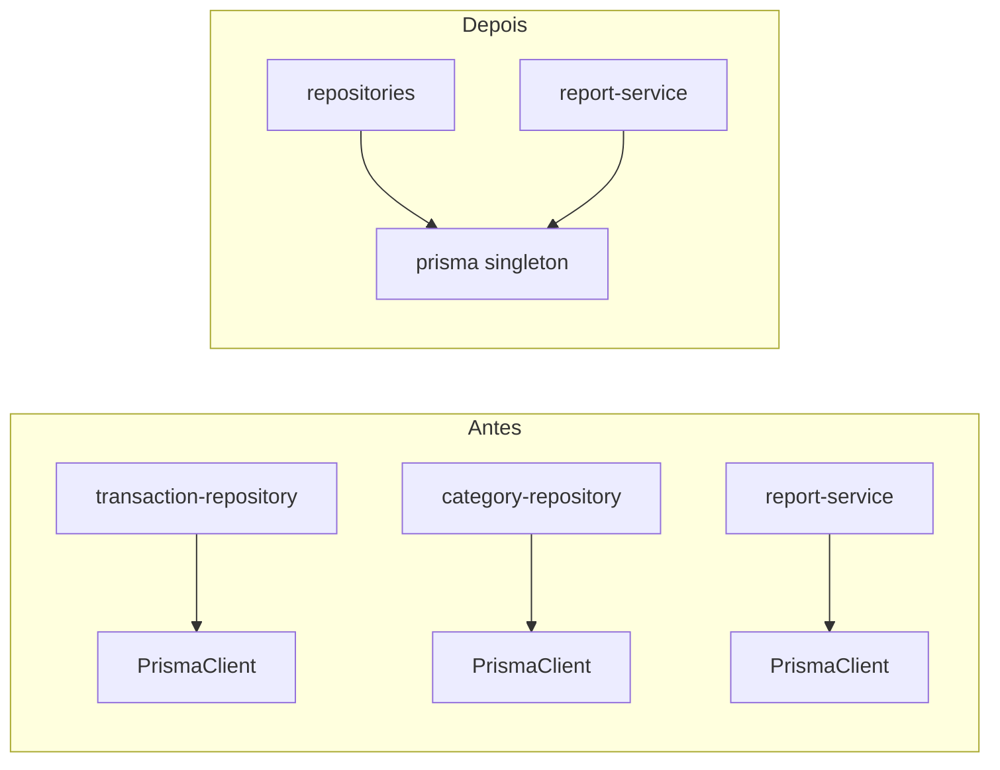

## 1. Instância única do Prisma

- **Problema resolvido:** vários pools e violação de DIP por `new PrismaClient()` espalhado (`[backend/src/repositories/*.js](backend/src/repositories/transaction-repository.js)`, `[backend/src/services/report-service.js](backend/src/services/report-service.js)`).
- **Técnica:** módulo compartilhado `[backend/src/lib/prisma.js](backend/src/lib/prisma.js)` (ou `db/prisma.js`) que exporta **uma** instância; repositórios e serviços fazem `require` desse módulo. Opcional: `beforeExit` / `disconnect` no shutdown do processo (útil quando separar worker da API).



- **Prompt:**

```
Refatore o projeto para garantir que exista apenas uma instância do PrismaClient.

Tarefas:
- Criar o arquivo: backend/src/lib/prisma.js
- Exportar uma única instância de PrismaClient (singleton)
- Substituir TODOS os usos de `new PrismaClient()` no projeto por importação desse singleton
- Garantir que repositórios e services usem esse módulo compartilhado
- (Opcional) adicionar tratamento de shutdown com disconnect

Requisitos:
- Não quebrar contratos existentes
- Manter compatibilidade com o restante do código

Testes:
- Criar testes garantindo que:
  - O Prisma não é instanciado múltiplas vezes
  - Services/repositories continuam funcionando corretamente com mock do Prisma
```

---

## 2. Relatório mensal: repositório dedicado + menos N+1

- **Problema resolvido:** inconsistência arquitetural (Prisma solto no service) e **N+1** em `budgetStatus` (um `aggregate` por orçamento em `[backend/src/services/report-service.js](backend/src/services/report-service.js)`).
- **Técnica:**
  - Criar `[backend/src/repositories/report-repository.js](backend/src/repositories/report-repository.js)` com métodos que concentram queries Prisma (transações do mês, budgets do mês, agregação de gastos).
  - **Uma** consulta agregada por `(categoryId)` para despesas no intervalo (ex.: `groupBy` + `_sum` no Prisma, ou query SQL única via `$queryRaw` se necessário) e montar `budgetStatus` em memória cruzando com a lista de budgets.
  - `report-service.monthly` passa a **orquestrar** apenas: chamar o repositório, calcular totais receita/despesa e `byCategory` (pode permanecer em JS sobre a lista já carregada para evitar duplicar lógica).

- **Prompt:**

```
Refatore a geração de relatório mensal para eliminar N+1 queries e melhorar arquitetura.

Tarefas:
- Criar: backend/src/repositories/report-repository.js
- Mover toda lógica de acesso a dados do report-service para esse repository
- Substituir múltiplos aggregates por uma única query agregada (groupBy ou equivalente)
- Construir o budgetStatus em memória a partir dos dados agregados
- Garantir que o report-service apenas orquestre chamadas

Requisitos:
- Reduzir queries ao banco
- Manter comportamento atual do relatório

Testes:
- Criar testes unitários para:
  - report-repository (mock do Prisma)
  - report-service (mock do repository)
- Validar:
  - cálculos corretos
  - ausência de múltiplas queries desnecessárias
```

---

## 3. Separar HTTP e job agendado (cron)

- **Problema resolvido:** `[backend/src/server.js](backend/src/server.js)` mistura `listen` com `node-cron`, impedindo escalar API horizontalmente sem repetir o job e dificultando testes isolados.
- **Técnica:** extrair o agendamento para `[backend/src/jobs/recurrence-cron.js](backend/src/jobs/recurrence-cron.js)` (ou `worker/recurrence-worker.js`) que importa `runRecurrenceJob` e registra o cron. Dois entrypoints:
  - `server.js` — apenas sobe o Express (importa `[app.js](backend/src/app.js)`).
  - `cron-worker.js` (novo) — apenas inicia o cron (e eventualmente `process.on` para shutdown).
  - Scripts em `[backend/package.json](backend/package.json)`: `"start"` para API, `"start:worker"` para o worker. Documentar no `[README.md](README.md)` que em produção com N réplicas da API roda-se **uma** instância do worker (ou fila + lock no futuro).

- **Prompt:**

```
Refatore o projeto para separar o cron job da API HTTP.

Tarefas:
- Criar: backend/src/jobs/recurrence-cron.js (ou worker equivalente)
- Criar novo entrypoint: backend/src/cron-worker.js
- Remover qualquer uso de cron do server.js
- Garantir que server.js apenas sobe a API
- Criar scripts no package.json:
  - "start"
  - "start:worker"
- Atualizar README com instruções

Requisitos:
- Evitar execução duplicada do cron em múltiplas instâncias
- Não quebrar a API existente

Testes:
- Criar testes para:
  - execução do job isoladamente
  - garantir que o cron chama a função correta
- Mockar dependências externas
```

---

## 4. Erros de domínio tipados

- **Problema resolvido:** `throw new Error` + `err.statusCode` manual espalhado nos services é frágil e inconsistente com `[error-handler](backend/src/middlewares/error-handler.js)`.
- **Técnica:** classe `HttpError` ou `AppError` (ex.: `[backend/src/errors/http-error.js](backend/src/errors/http-error.js)`) com `statusCode` e `code` opcional; serviços passam a `throw new HttpError(404, '...')`. Manter `[error-handler](backend/src/middlewares/error-handler.js)` lendo `statusCode`/`code` (já compatível).

- **Prompt:**

```
Padronize o tratamento de erros do backend.

Tarefas:
- Criar: backend/src/errors/http-error.js
- Implementar classe HttpError com:
  - statusCode
  - message
  - code (opcional)
- Substituir todos os `throw new Error` nos services por HttpError
- Garantir compatibilidade com o error-handler existente

Requisitos:
- Não alterar contratos HTTP
- Manter mensagens de erro existentes quando possível

Testes:
- Criar testes para:
  - lançamento correto de erros tipados
  - integração com error-handler
  - retorno correto de status HTTP
```

---

## 5. Frontend: DRY (`formatMoney`, `TYPES`)

- **Problema resolvido:** duplicação em `[transactions-page.jsx](frontend/src/pages/transactions-page.jsx)`, `[dashboard-page.jsx](frontend/src/pages/dashboard-page.jsx)`, `[budgets-page.jsx](frontend/src/pages/budgets-page.jsx)`, `[categories-page.jsx](frontend/src/pages/categories-page.jsx)`.
- **Técnica:** `[frontend/src/utils/format-money.js](frontend/src/utils/format-money.js)` e `[frontend/src/constants/transaction-types.js](frontend/src/constants/transaction-types.js)` (ou um único `finance-constants.js`); páginas importam.

- **Prompt:**

```
Refatore o frontend para remover duplicações.

Tarefas:
- Criar:
  - frontend/src/utils/format-money.js
  - frontend/src/constants/transaction-types.js
- Remover duplicações nas páginas:
  - transactions
  - dashboard
  - budgets
  - categories
- Centralizar lógica de formatação e constantes

Requisitos:
- Não alterar comportamento visual
- Manter consistência de formatação

Testes:
- Criar testes para:
  - formatMoney (casos edge incluídos)
  - uso correto das constantes
```

---

## 6. Frontend: reduzir páginas “gordas” (hook opcional)

- **Problema resolvido:** padrão repetido `load` + `useEffect` + `setLoading/setError` acopla views à rede.
- **Técnica:** hook genérico `[frontend/src/hooks/use-async-resource.js](frontend/src/hooks/use-async-resource.js)` (ou `useFetchState`) que recebe uma função `load()` e dependências, retorna `{ data, loading, error, reload }`. Refatorar 1–2 páginas piloto (ex.: dashboard e categorias) e alinhar o restante no mesmo padrão se o ganho for claro; **não** obrigar abstração excessiva nas páginas mais simples se só duplicar complexidade.

- **Prompt:**

```
Refatore o frontend para reduzir repetição de lógica assíncrona.

Tarefas:
- Criar: frontend/src/hooks/use-async-resource.js
- Implementar retorno:
  - data
  - loading
  - error
  - reload
- Refatorar pelo menos:
  - dashboard page
  - categories page

Requisitos:
- Evitar complexidade desnecessária
- Manter legibilidade das páginas

Testes:
- Criar testes para o hook:
  - loading state
  - sucesso
  - erro
  - reload funcionando corretamente
```

---

## 7. Correção `parseFloat` em transações

- **Problema resolvido:** segundo argumento em `parseFloat` não existe / confunde leitores em `[transactions-page.jsx](frontend/src/pages/transactions-page.jsx)`.
- **Técnica:** usar `parseFloat(form.amount)` ou `Number(form.amount)` com validação já existente (`Number.isFinite`).

- **Prompt:**

```
Corrija uso incorreto de parseFloat no frontend.

Tarefas:
- Substituir parseFloat com segundo argumento inválido
- Usar:
  - parseFloat(valor) OU Number(valor)
- Garantir validação com Number.isFinite

Requisitos:
- Não quebrar inputs existentes
- Manter comportamento atual

Testes:
- Criar testes para:
  - parsing válido
  - valores inválidos
  - edge cases (string vazia, null, etc.)
```

---

## 8. Testes automatizados (rede mínima)

- **Problema resolvido:** zero testes impede refatorar Prisma/cron com segurança.
- **Técnica:** Vitest no **frontend** (já Vite) para `format-money` e, se criado, o hook; Jest ou Node `test` runner no **backend** com `jest.mock` do módulo singleton Prisma **ou** testes de integração leves com SQLite/DB de teste (escolha uma linha para não inflar o MVP: **preferir unitários com mock do repositório/report-repository** após extração). Cobrir pelo menos: `transaction-service.create` (happy path + categoria inexistente) e uma função pura de montagem do relatório se extraída.

- **Prompt:**

```
Configure estrutura mínima de testes no projeto.

Tarefas:
- Frontend:
  - Configurar Vitest
- Backend:
  - Configurar Jest ou node:test
- Criar mocks do Prisma singleton
- Criar testes iniciais para:
  - transaction-service.create
  - report logic (se extraída)

Requisitos:
- Testes rápidos e isolados
- Evitar dependência de banco real

Testes:
- Garantir cobertura mínima das funções críticas
- Validar cenários de sucesso e erro
```

---

## 9. Obsolescência e higiene

| Item                             | Problema resolvido                                                                                             | Técnica                                                                                                                                                                                                   |
| -------------------------------- | -------------------------------------------------------------------------------------------------------------- | --------------------------------------------------------------------------------------------------------------------------------------------------------------------------------------------------------- |
| `**postinstall` TLS              | `NODE_TLS_REJECT_UNAUTHORIZED=0` em `[backend/package.json](backend/package.json)` enfraquece TLS globalmente. | Remover do `postinstall`; usar CA corporativa via `NODE_EXTRA_CA_CERTS` ou documentar proxy; manter só `prisma generate` sem desabilitar TLS.                                                             |
| **ESLint (+ Prettier opcional)** | Falta de gate de estilo/bugs estáticos.                                                                        | `eslint` com flat config ou `.eslintrc` em `backend/` e `frontend/`, regras mínimas (`no-unused-vars`, etc.), script `lint` nos `package.json`.                                                           |
| **Auth mock e Open/Closed**      | Trocar auth exige editar middleware.                                                                           | Extrair factory ou `createAuthMiddleware({ getUser })` em `[auth.js](backend/src/middlewares/auth.js)` com implementação default mock; JWT vira novo módulo sem alterar rotas. **Fase opcional** pós-MVP. |
| **TypeScript no backend**        | Assimetria com frontend.                                                                                       | **Fase opcional/distinta:** migrar incremental (`allowJs`) ou deixar documentado como roadmap; não bloquear os itens acima.                                                                               |

- **Prompt:**

```
Melhore a higiene e segurança do projeto.

Tarefas:
- Remover:
  - NODE_TLS_REJECT_UNAUTHORIZED=0 do postinstall
- Configurar ESLint:
  - backend
  - frontend
- Criar script "lint"
- (Opcional) criar factory de auth middleware

Requisitos:
- Não quebrar build
- Melhorar segurança e consistência

Testes:
- Validar:
  - lint funcionando
  - aplicação rodando sem TLS inseguro
```

---

## 10. Contrato da API no frontend (acoplamento ao envelope)

- **Problema resolvido:** `data?.data ?? data` repetido nos services aumenta acoplamento ao formato HTTP.
- **Técnica:** interceptor Axios em `[frontend/src/utils/api-client.js](frontend/src/utils/api-client.js)` que normaliza resposta de sucesso (extrai `.data` do payload JSON uma vez) **ou** função `unwrap(response)` usada pelos services — uma única convenção documentada.

- **Prompt:**

```
Refatore o frontend para desacoplar o código do formato de resposta HTTP da API.

Problema:
- Existe repetição de `data?.data ?? data` nos services
- Isso acopla o frontend ao formato do backend
- Dificulta manutenção e mudanças futuras no contrato da API

Tarefas:
- Implementar uma padronização de resposta no frontend usando UMA das abordagens:

Opção A (preferencial):
- Criar/atualizar: frontend/src/utils/api-client.js
- Adicionar um interceptor do Axios que:
  - Intercepte respostas de sucesso
  - Retorne diretamente `response.data.data` quando existir
  - Caso contrário, retorne `response.data`
- Garantir que os services passem a receber dados já normalizados

Opção B:
- Criar função utilitária:
  - `unwrap(response)`
- Substituir todos os usos de `data?.data ?? data` por essa função

- Refatorar todos os services para usar a abordagem escolhida
- Remover completamente duplicações existentes

Requisitos:
- Não quebrar chamadas existentes
- Manter compatibilidade com erros da API
- Garantir consistência em todo o projeto

Testes:
- Criar testes para:
  - Interceptor ou função unwrap
  - Respostas com formato:
    - { data: {...} }
    - {...} (sem envelope)
  - Garantir que o retorno final seja sempre consistente
- Validar que os services continuam funcionando corretamente com dados mockados
```

---
